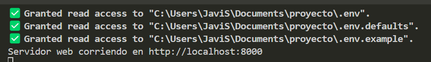

# 📌 Instrucciones para ejecutar el proyecto

## 🔁 Clonar el repositorio

```bash
git clone https://github.com/Ruth-ZS/proyecto.git
cd proyecto
```

---

## ⚙️ Requisitos

### ✅ Tener **Deno** instalado

Verifica si ya tienes Deno ejecutando:

```bash
deno --version
```

Si no está instalado, puedes instalarlo con el siguiente comando en PowerShell:

```powershell
iwr https://deno.land/install.ps1 -useb | iex
```

🔄 Luego de instalar Deno, **reinicia Visual Studio Code** para que los cambios se apliquen correctamente.

---

### ✅ Tener PostgreSQL instalado y corriendo

- Asegúrate de tener PostgreSQL instalado (versión recomendada 13 o superior).
- Verifica que el **servicio esté corriendo**.
- Debes saber la contraseña del usuario `postgres` o configurar una nueva.
- ⚠️ **Este proyecto está diseñado para conectarse a una base de datos existente.**  
  El código **no crea la base de datos automáticamente**, solo se conecta a ella.  
  Por lo tanto, es muy importante que antes de ejecutar el código, te asegures de que la base de datos existe.

---

### ✅ Crear base de datos

1. Abre **DBeaver** o cualquier cliente SQL compatible.
2. Conéctate como usuario `postgres`.
3. Ejecuta el siguiente comando en una consola SQL:

```sql
CREATE DATABASE trabajo;
```

> Si prefieres usar otra base (como `postgres`), recuerda modificar también el `.env`.

---

### ✅ Crear archivo `.env`

En la raíz del proyecto, crea un archivo llamado `.env` con el siguiente contenido (según tus datos locales):

```env
DB_USER=postgres
DB_PASSWORD=tu_contraseña
DB_NAME=trabajo
DB_HOST=localhost
DB_PORT=5432
```

> Puedes usar el archivo `.env.example` como referencia.

---

## ▶️ Ejecutar el proyecto

1. Asegúrate de estar en la raíz del proyecto donde se encuentra el archivo `main.ts`
2. Ejecuta el proyecto con Deno:

- Con permisos de entorno:

```bash
deno run --allow-env main.ts
```

- Con permisos para entorno y red (recomendado):

```bash
deno run --allow-env --allow-net main.ts
```

> ⚠️ Te va a pedir permisos, ingresa "y" las 3 veces para otorgarlos si no usas `--allow-all`.

> ⚠️ **Importante:** Si no está corriendo PostgreSQL, o el `.env` está mal configurado, la conexión fallará.

---

---

## 📷 Ejemplo de ejecución exitosa

A continuación, se muestra cómo se ve la consola luego de ejecutar el comando y otorgar los permisos correctamente (`y` 3 veces):




## 🔐 ¿No sabes tu contraseña de PostgreSQL?

Si no recuerdas la contraseña del usuario `postgres`, la forma más rápida y limpia de solucionarlo es:

### 🔁 **Reinstalar PostgreSQL**
- Puedes desinstalar PostgreSQL completamente desde el panel de control.
- Luego vuelve a instalarlo desde [https://www.postgresql.org/download/windows/](https://www.postgresql.org/download/windows/)
- Durante la instalación, **se te pedirá crear una nueva contraseña** para `postgres`.

> Esto asegura que puedas conectarte fácilmente y evitar errores de autenticación.
---

---

## 🛠️ Comandos útiles de Git

- Ver en qué rama estás trabajando actualmente:

```bash
git branch
```

- Crear una nueva rama y cambiar a ella:

```bash
git checkout -b nombre-de-tu-rama
```

- Cambiar a una rama existente:

```bash
git checkout nombre-de-tu-rama
```

- Ver los cambios pendientes:

```bash
git status
```

- Agregar todos los archivos modificados:

```bash
git add .
```

- Hacer commit con mensaje:

```bash
git commit -m "tu mensaje"
```

- Subir tu rama al repositorio remoto:

```bash
git push origin nombre-de-tu-rama
```

- Traer cambios del repositorio remoto:

```bash
git pull origin main
```